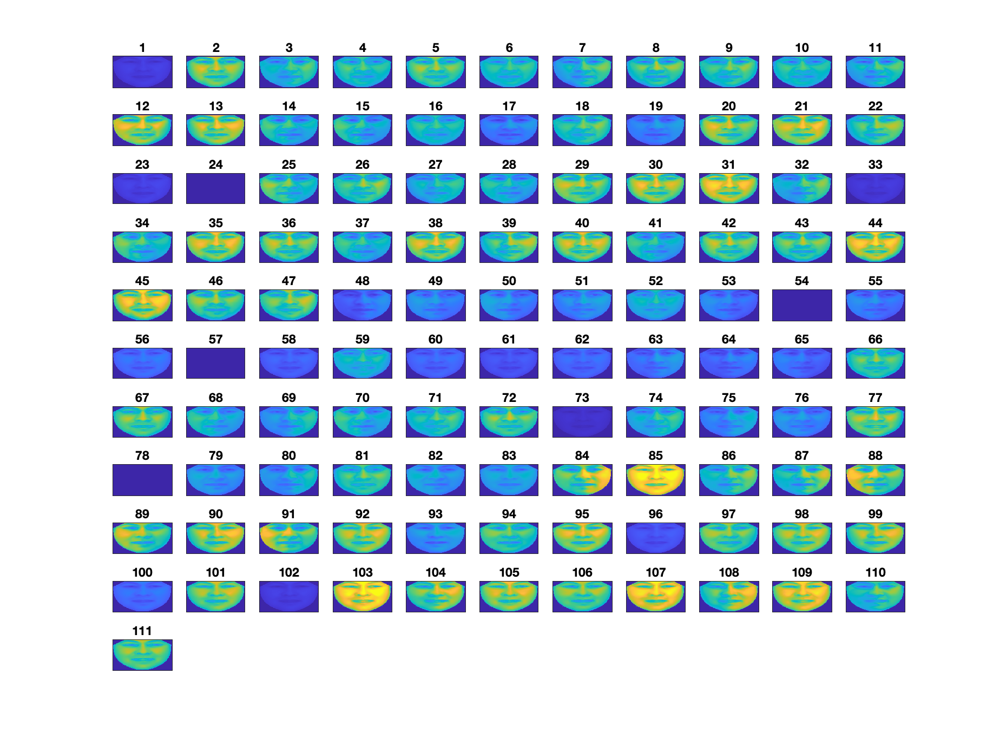

# Compressed Sensing Project

Cem Daloglu and Lia Schmid 
Summer Term 2022 - Stefania Petra

# Ex1

a) Declare a recovery successful if the averaged normalized recovery error ≤ 10−6. What do you conclude?

In general, reconstruction using l1 and OMP were the most successful.
CoSaMP did not recover the signals well for both sensor matrices. 
BT and MP recovery was not too bad. 
For low sparsity levels in general the algorithm performes better compared to high sparsity levels. 
In gerenal we expected the averaged normalized recovery error to be lower as could also be seen in the lecture notes. 

Furthermore, we observed that running the algorithms took a lot of time, this might also be because of the usage of cvx. 

## Random matrix
- IHT shows weird results, we are unsure what is going on there. 

## Fourier matrix 
- SP only good for really sparse signals. 
- CoSaMP reconstruction is also not so good and the error remains quite constant. 

# Ex2
With a lambda value of 10 we achieved reasonably good results using the smallest dataset. 

